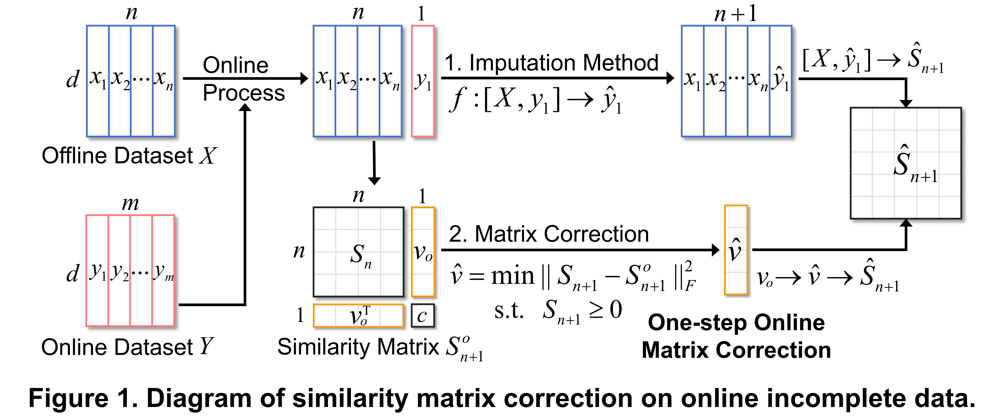

# **OnMC**: **On**line Similarity **M**atrix **C**orrection

----------

The source code for the UAI'2023 paper titled "**Online Estimation of Similarity Matrices with Incomplete Data**".


## Introduction
----------

This Github repository contains the implementation of our proposed *Online Simlarity Matrix Correction* algorithms, designed to enhance the estimation of similarity matrices in online scenarios, especially when dealing with incomplete observations. The algorithms are built leveraging the positive semi-definiteness (PSD) of the similarity matrix, ensuring a solid theoretical performance guarantee and an excellent potential for parallel execution on large-scale data.


## Method
----------

<p align="center">
    
</p>

**Traditional solution:** to impute the online incomplete data by $y \rightarrow \hat{y}$

- Cons: highly relies on data assumptions without a guarantee on similarities

**Proposed method:** to correct the online similarity vector by $v \rightarrow \hat{v}$

- Pros: has a theoretical guarantee on the quality of the corrected similarity matrix

<p align="center">
    
</p>

## Folders and files
---------

<pre>
./                              - Top directory.
./README.md                     - This readme file.
./example_main.m                - Demo of online scenario with incomplete data.
./example_scale.m               - Demo of scalability analysis.
./demo_data.mat                 - A demo dataset. 
./similarity.m                  - Similarity matrix approximation on incomplete data. 

|Baseline/                      - Some imputation baseline methods.
|Our_Method/                    - Our proposed similarity matrix correction methods.
   ./correct_offmc.m            - Offline similarity matrix correction method.
   ./correct_onmc_s.m           - Online similarity matrix correction for sequential data.
   ./correct_onmc_b.m           - Online similarity matrix correction for batch data.
   ./correct_onmc_l.m           - Online similarity matrix correction for large-scale data.
</pre>


## Citation
---------

If you find this code useful for your research, please use the following BibTeX entry.

```
@inproceedings{yu2023online,
  title={Online estimation of similarity matrices with incomplete data},
  author={Yu, Fangchen and Zeng, Yicheng and Mao, Jianfeng and Li, Wenye},
  booktitle={Uncertainty in Artificial Intelligence},
  pages={2454--2464},
  year={2023},
  organization={PMLR}
}
```

## Contact
---------
If you have any problems or questions, please contact the author: Fangchen Yu (email: fangchenyu@link.cuhk.edu.cn)